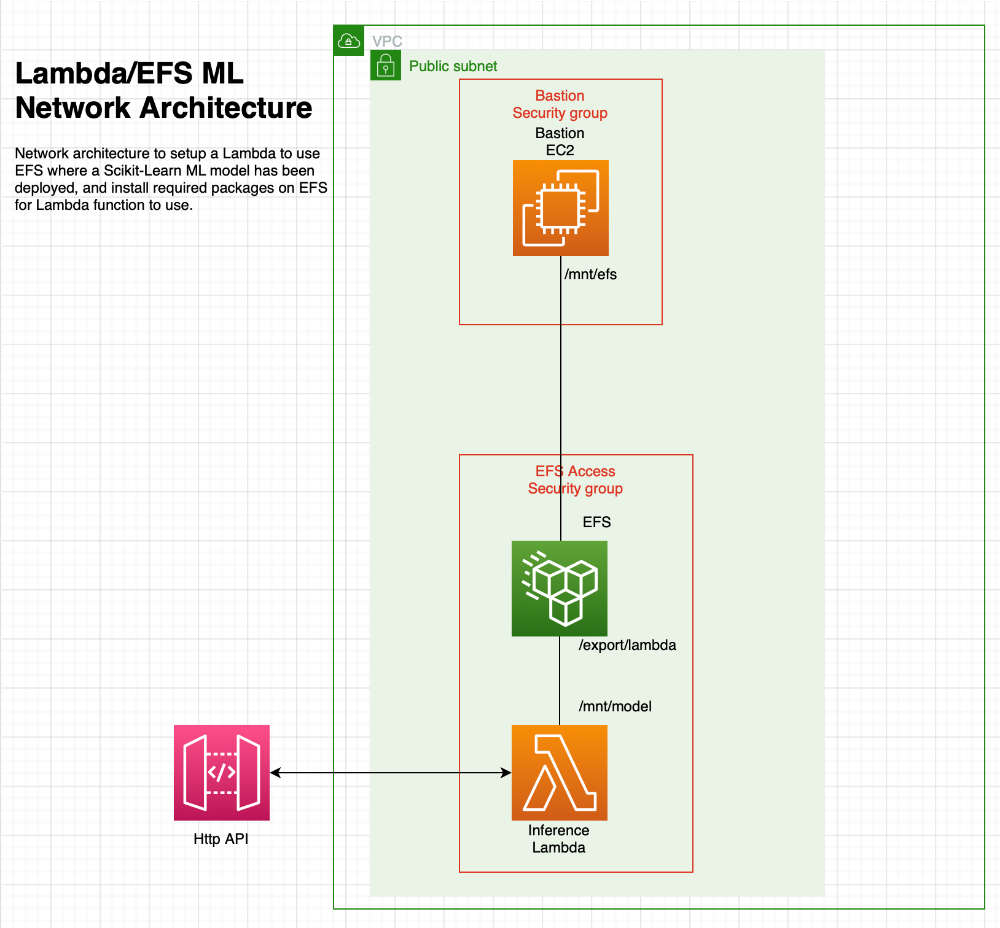

# AWS Lambda / EFS Machine Learning network architecture 

## Goal

Create a network architecture to allow a Lambda function to execute a Scikit-Learn machine learning model.


--------

It does not get easier than this, but it is still helpful to start out easy.




This repo contains a short example of how to use the v2/alpha CDK to create a simple HttpApi gateway proxy to a Lambda function using the latest ( 3/4/2022 ) CDK contructs

## AWS CDK V2 

https://aws.amazon.com/blogs/developer/experimental-construct-libraries-are-now-available-in-aws-cdk-v2/

### CDKv2 Python Reference

https://docs.aws.amazon.com/cdk/api/v2/python/index.html

### AWS Lambda VPC Endpoint Docs

https://www.alexdebrie.com/posts/aws-lambda-vpc/

https://docs.aws.amazon.com/lambda/latest/dg/configuration-vpc.html#vpc-samples

https://aws.amazon.com/blogs/compute/announcing-improved-vpc-networking-for-aws-lambda-functions/


```text
To mount an EFS file system, your Lambda functions must be connected to an Amazon Virtual Private Cloud (VPC) that can reach the EFS mount targets.
```

The EFS file system is automatically mounted by EC2 under /mnt/efs/fs1

### Reference Material

[EFS with Lambda Playlist](https://www.youtube.com/watch?v=4cquiuAQBco&list=PL5KTLzN85O4L0rYTtGVKxPr4yQ5oHMYOn)
[How to install library on EFS & import in lambda](https://www.youtube.com/watch?v=FA153BGOV_A)

https://dev.to/cdkpatterns/attach-a-filesystem-to-your-aws-lambda-function-3bi9

### Connecting EC2 to FileSystem
[Watch This: How to create and Mount an Amazon EFS Filesystem ](https://www.youtube.com/watch?v=I9GO3mYeNAM)

* Need the FileSystem ID

NOTE: The /export/lambda directory will not show up in the EC2 instance until the lambda tries to access that mount point.  So you have to hit the lambda once.  I am not sure how to get around that right now.


```shell
sudo mkdir /mnt/efs
sudo yum install -y amazon-efs-utils
sudo mount -t efs fs-ID:/ /mnt/efs
sudo mkdir /mnt/efs/export/lambda/venv
sudo chmod -R go+rwx /mnt/efs
sudo pip3 install --target /mnt/efs/export/lambda/venv pandas
sudo pip3 install --target /mnt/efs/export/lambda/venv scikit-learn


sudo useradd --uid 1001 mluser

sudo passwd mluser 
# pwd: ou8122112

su mluser
```

To see how to setup access from EC2 to FileSystem see:

https://docs.aws.amazon.com/cdk/api/v1/python/aws_cdk.aws_efs/README.html

search for: "Mounting the FileSystem using UserData"

### Install Python3.9 on AWS Linux

https://tecadmin.net/install-python-3-9-on-amazon-linux/

### Install Python Packages on EFS with EC2 for Lambda

https://towardsdatascience.com/deploying-large-packages-on-aws-lambda-using-efs-3a707f83d918

```shell
sudo pip3 install --target /mnt/efs/export/lambda/venv pandas
sudo pip3 install --target /mnt/efs/export/lambda/venv scikit-learn

```

### Copy Model File

```shell
scp -i ~/.ssh/pryan-aws.pem /Users/patrickryan/Development/aws/cdk-sandbox/api-lambda-example/ml-model/heart_model.pkl ec2-user@3.94.29.78:/mnt/efs/export/lambda
```

### Welcome to your CDK Python project!

This is a blank project for Python development with CDK.

The `cdk.json` file tells the CDK Toolkit how to execute your app.

This project is set up like a standard Python project.  The initialization
process also creates a virtualenv within this project, stored under the `.venv`
directory.  To create the virtualenv it assumes that there is a `python3`
(or `python` for Windows) executable in your path with access to the `venv`
package. If for any reason the automatic creation of the virtualenv fails,
you can create the virtualenv manually.

To manually create a virtualenv on MacOS and Linux:

```
$ python3 -m venv .venv
```

After the init process completes and the virtualenv is created, you can use the following
step to activate your virtualenv.

```
$ source .venv/bin/activate
```

If you are a Windows platform, you would activate the virtualenv like this:

```
% .venv\Scripts\activate.bat
```

Once the virtualenv is activated, you can install the required dependencies.

```
$ pip install -r requirements.txt
```

At this point you can now synthesize the CloudFormation template for this code.

```
$ cdk synth
```

To add additional dependencies, for example other CDK libraries, just add
them to your `setup.py` file and rerun the `pip install -r requirements.txt`
command.

## Useful commands

cdk bootstrap --profile pryan
- creates a cloudformation stack called:  'CDKToolkit'

 * `cdk ls`          list all stacks in the app
 * `cdk synth`       emits the synthesized CloudFormation template
 * `cdk deploy`      deploy this stack to your default AWS account/region
 * `cdk destroy`     destroy this stack
 * `cdk diff`        compare deployed stack with current state
 * `cdk docs`        open CDK documentation

Enjoy!
